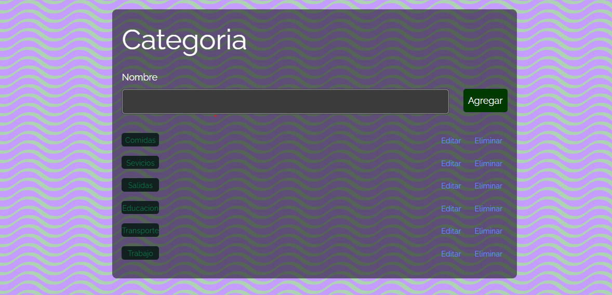

# Proyecto Ahorradas

#### Alumnas:

[Tamara Zarate](https://github.com/taty3385) y
[Maria Sol Gonzalez](https://github.com/GonzalezMariaSol)

### Proyecto **Ahorradas** creado para la comisión n19 de _ADA ITW_

  

En el proyecto se aplicaron contenidos aprendidos del modulo 3 - Estructura de Datos

- Git
- Arrays
- Bucles
- Uso de framework - Tailwind
- Objetos I Y II
- Metodos Array
- Array de Objetos

  
Parte hecha por Sol

  - <kbd>Vista y funcionalidad del Navbar</kbd>
  - <kbd>Vista y funcionalidad Balance</kbd>
  - <kbd>Vista y funcionalidad Filtros</kbd>
  - <kbd>Vista y funcionalidad Operaciones cargadas</kbd>
  - <kbd>Vista y funcionalidad Nuevas Operaciones</kbd>
  - <kbd>Vista y funcionalidad Editar Operacion</kbd>
  - <kbd>Vista y funcionalidad Eliminar Operacion</kbd>
  - <kbd>Creacion del Readme</kbd>
  
  - <kbd>
    

      
<h4>Como terminó Sol luego del proyecto</h4>

      - 
    

  </kbd>

  
Parte hecha por Tamara

   - Vista y funcionalidad de Categorias</kbd>
- <kbd>Vista y funcionalidad de Nueva Categoria</kbd>
- <kbd>Vista y funcionalidad de Editar Categorias</kbd>
- <kbd>Vista y funcionalidad de Eliminar Categorias</kbd>
- <kbd>Vista y funcionalidad Reportes</kbd>
- <kbd>Resumen</kbd>
- <kbd>Totales por categorías</kbd>
- <kbd>Totales por mes</kbd>
- <kbd>Disenio responsivo del proyecto categoria y reportes</kbd>
   
  

     
<h4>Como terminó Tamara luego del proyecto</h4>

     - 
  

  </kbd>

Proyecto _Ahorradas_ es un trabajo personal/grupal, siguiendo instrucciones pedidas. [^.]

[^.]: Cualquier comentario constructivo sentirse libre de contactarme.
